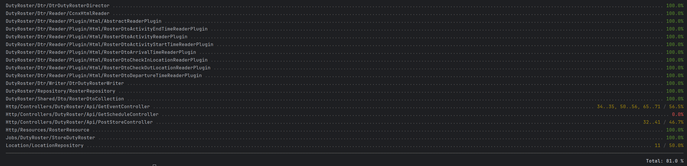

<p align="center"><a href="https://laravel.com" target="_blank"></a></p>

<p align="center">
<a href="https://github.com/laravel/framework/actions"></a>
<a href="https://packagist.org/packages/laravel/framework"></a>
<a href="https://packagist.org/packages/laravel/framework"></a>
<a href="https://packagist.org/packages/laravel/framework"></a>
</p>

## Installation

> Note: When running application for the first time (or hasn't got **vendor** folder) simply run:
> ```bash
> docker run --rm \
>    -u "$(id -u):$(id -g)" \
>    -v "$(pwd):/var/www/html" \
>    -w /var/www/html \
>    laravelsail/php82-composer:latest \
>    composer install --ignore-platform-reqs
> ```

1. Run `./vendor/bin/sail build`
1. When project will be built run `./vendor/bin/sail up -d`
1. To run migrations for database run `./vendor/bin/sail artisan migrate`

## API

* Under **./routes** folder exists latest postman collection for all available API routes.

## Testing

#### Report

Current report for project files:


> For CLI report you can run `./vendor/bin/sail  artisan test --coverage`

1. To generate tests report use `./vendor/bin/sail artisan test --coverage-html ./.coverage` command
1. Report will be generated in **./.coverage** folder. Open *index.html* file to review it

#### Run tests
1. Run command `./vendor/bin/sail artisan test` to run all tests
